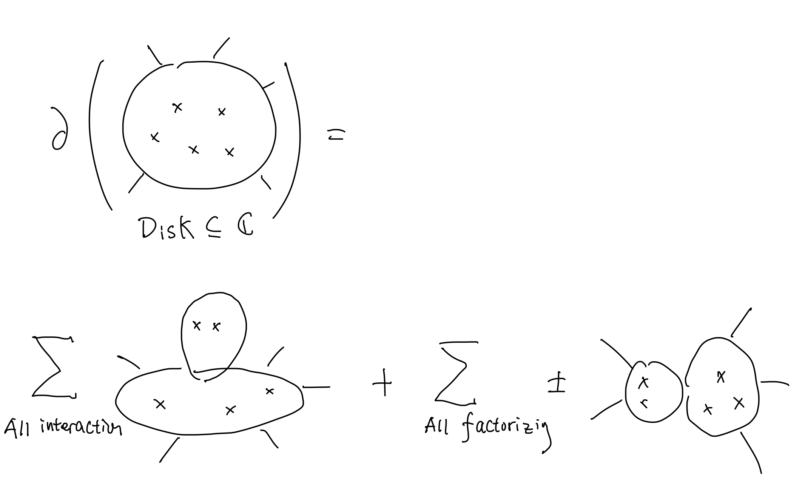

# Poisson Sigma Model and Configuration Space

## Polyvector Field and Poisson Sigma Model

### Polyvector Field

Consider $X$ be a $d < \infty$ manifold, then there is a $\mathbb{Z}$ *graded vector space* $\Omega^{*}(X)$, which could identified with cotangent bundle $T^{\star}X = \bigwedge T^{k}X$.
At the dual side, we can consider another $\mathbb{Z}$-graded vector space $\mathrm{PV}(X)$ called **polyvector field**, which could be identified with the tangent bundle $TX = \bigoplus T^{k}X$. 

There is no non-trivial degree $1$ derivative over $\mathrm{PV}(X)$ due to the canonical Lie structure over tangent bundle.
However, due to the natural isomorphism between the tangent bundle and the cotangent bundle, i.e. 
$$\mu : \mathrm{PV}(X) \mapsto \Omega^{d-n}(X)$$
which could be viewed as natural pairing, we can consider the $-1$ degree derivative
$$\Delta_{\omega} = \mu^{-1} \circ \mathrm{d}  \circ\mu$$
which is similar to
$$
\begin{CD}
  \Omega^{n}(X) @> \mathrm{d} >> \Omega^{n+1}(X) \\
  @V \mu^{-1} VV @VV \mu^{-1} V \\
  \mathrm{PV}^{d-n}(X) @> \Delta_{\omega} >> \mathrm{PV}^{d-n-1}(X)
\end{CD}
$$

Note $\mathrm{PV}(X)$ is a DGLA, we can define a  natural bilinear pairing over $\mathrm{PV}(X)$, which is called **Schouten-Nijenhuis bracket**.
By definition, the Schouten-Nijenhuis bracket is a graded antisymmetric bilinear map given by
$$
 [X_{1} \wedge \cdots \wedge X_{k}, Y_{1} \wedge \cdots \wedge Y_{l}]_{\mathrm{SN}} = \sum_{i,j} (-1)^{i+j} [X_{i}, Y_{j}] \wedge \cdots \wedge \hat{X_{i}} \wedge \cdots \wedge \hat{Y_{j}} \wedge \cdots
$$
With the definition of Schouten-Nijenhuis bracket, consider the Poisson manifold $(X, \pi)$, where $\alpha \in \mathrm{PV}^{2}(X)$, we can define the Poisson bracket over $\Omega^{*}(X)$ by
$$
  \left\{ f,g \right\} = \alpha(\mathrm{d}f, \mathrm{d}g)
$$
where the Jacobi identity is equivalent to the condition that $[\alpha,\alpha]_{\mathrm{SN}} = 0$.
With the definition of $\alpha$ one can consider the canonical $1$ degree derivative $\Delta_{\alpha} = [\alpha, \cdot]$.
So we can consider the cohomology of complex $(\mathrm{PV},b_{\alpha}) $, which is called **Poisson cohomology**.
Using the canonical isomorphism between $\mathrm{PV}(X)$ and $\Omega^{*}(X)$, we can consider the Poisson cohomology as the cohomology of the complex $(\Omega^{*}(X), \mathrm{d} + \left\{ \alpha, \cdot \right\})$ i.e the Poisson cohomology is isotopic to the de Rham cohomology.

> An useful fact: $\mathrm{PV}(X) \cong HH(\mathcal{A},\mathcal{A})$ where $\mathcal{A} = C^{\infty }(X)$ is the smooth function ring over $X$.

### Poisson Sigma Model (First Glance)

Poisson sigma model is an interesting theory which is a topological field theory (TFT) over worldsheet $\Sigma$ with target space $X$, where the basic object are
$$\phi : \Sigma \rightarrow X$$
$$\eta : \Sigma \mapsto \phi^{*}T^{*}X \otimes T^{*}X$$
i.e. $\eta \in \Omega^{1}_{X}(\phi^{*}T^{*}X)$.
Under the local coordinate, the objects could be constructed similar to the superspace $(\phi^{i}(u) e_{i},\eta(u)^{a}_{i} \mathrm{d} u_{a} \otimes \mathrm{d} \phi^{i})$.
Plugging $\eta^{a}_{i} \mathrm{d} u_{a}$ into $\{\eta_{i}\}_{i}$, using the language of DGLA, we can rewrite the object above as
$$
  (\phi, \eta) \in \Gamma(\Sigma; \bigwedge^{\infty } T^{*}M [1])
$$
where $\deg \phi^{i} = 0$ and $\deg \eta_{i} = 1$, which is because $\eta_{i}$ is a $1$-form over $\Sigma$.

From the consider above, we can construct Poisson structure by $\eta_{i}$, where $\frac{1}{2} \alpha^{ij}(\phi) \eta_{i} \eta_{j}$.
When we consider the observables $\mathcal{O}(T^{*}M[1]) \cong \mathrm{PV}(M)$ i.e. the space of objects and observables could be viewed as $\mathrm{PV}(M) = HH(\mathcal{A},\mathcal{A})$ where $\mathcal{A}$ is the smooth function ring over $M$.
However, due to the odd degree of $\eta_{i}$, the polyvector field should be shifted via $\mathrm{PV}(M)[1]$ i.e. the $T_{poly}(M)$
$$
  T_{poly}(M) = \Gamma(\Sigma; \bigwedge^{\infty } TM )[1]
$$
Thus we can similarly define the shifted Hoshchild cochain complex $CH(\mathcal{A},\mathcal{A})[1]$, which is
$$
  D_{poly} = Hom(\mathcal{A}^{\otimes n},\mathcal{A})[1]
$$
in Kontsevich's language, where $\mathcal{A} = C^{\infty }$.

Back to the discussion of deformation quantization and formality conjecture, which reveals the equivalence between quantization and quasi-isomorphism between $T_{poly}$ and $D_{poly}$.
The discussion of Poisson sigma model over $\Sigma$ shows the equivalence between local observable and $\mathrm{PV}(M)[1]$.
On the other hand, the observable from $\mathcal{A}$ is the smooth function over $1$ dimensional time line,
so it's natural to position a mechanical system on $\partial \Sigma$, and consider the action of Poisson sigma model observables $PV(M)[1]$ to smooth function $\mathrm{Hom}(\mathcal{A}^{\otimes n},\mathcal{A})[1]$.
The path integral quantization of Poisson sigma model would immediately gives the quantization of classical mechanics.

## Configuration Space and Compactification

### FMAS-compactification without Boundary

Consider a manifold $\mathcal{M}$ and a finite set $S$, which identified with space-time manifold and particles, the open configuration space of $S$ in $\mathcal{M}$ is defined as
$$\mathrm{Comf}_{S}(\mathcal{M}) \equiv \left\{ \iota : S \rightarrow \mathcal{M}  \right\}$$
which is given by an indution. 

A collapsed $S$ configuration is the result of a collapse of a subset of the particles in $S$-configuration.
The collapsed configuration space is defined as

Let $\mathfrak{B} = \left\{ S_{i} \right\}_{i = 1}^{k}$ is a partition of $S$, then the collapsed configuration space is defined as a set $\{(p_{i},c_{i})\}_{i = 1}^{k}$, where

* $p_{i} \in \mathcal{M}$ and $p_{i} \neq p_{j}$ for $i \neq j$;

* $c_{i} \in \bar{C}_{S_{i}}(T_{p_{i}}\mathcal{M})$ is a configuration of $S_{i}$ in $\mathcal{M}$, where for $\# S = 1$, $\bar{C}_{S}(T_{p}\mathcal{M}) = \left\{ \mathrm{pt} \right\}$ and for $\left| S \right| \ge 2 $,
$$\bar{C}_{S}(X) = \coprod_{\mathfrak{B}, S} \left\{ (x_{i},c_{i})_{i = 1}^{k} ; \ (x_{i},c_{i}) \text{a $\mathfrak{B}$ collapsed $S$ - configuration in $X$}\right\} / (X \times \mathbb{R}_{>0})$$
where $X \times \mathbb{R}$ acts on $(x_{i},c_{i})$ via $(x_{i}, c_{i}) \mapsto (\phi(x_{i}), \mathrm{d} \phi (c_{i}))$.
Intuitively, the collapsed configuration space is a space which remembers the position of particles in $S_{i}$ with $p_{i}$ and the relate position with $c_{i}$ (which remembers the way they merge together).

> collapsed: merge together from $S$ to $\left\{ S_{i} \right\}_{i =1}^{k}$ on $\left\{ p_{i} \right\}_{i=1}^{k}$ with relative position $\left\{ c_{i} \right\}_{i=1}^{k}$.

With the same idea, we can consider the definition of FMAS-compactification without boundary, which is defined as

* The compactifified configuration space $C_{S}(\mathcal{M})$ of $S$ in $\mathcal{M}$ is given by
$$C_{S}(\mathcal{M}) \equiv \coprod_{S_{1},\cdots ,S_{k}, S = \bigsqcup_{\sigma} S_{\sigma}} \left\{ (p_{i},c_{i}) _{i = 1}^{k}; \ (p_{i},c_{i}) \text{ a $\mathfrak{B}$ collapsed $S$-configuration in $\mathcal{M}$}\right\}$$
which describes the way that particles in $S$ merge together to form a configuration in $\mathcal{M}$ ( instead of in $X$, whose behavier is remembered by $\bar{C}_{S}(X)$ ).
Thus an element of $C_{S}(\mathcal{M})$ is a configuration of $S$ in $\mathcal{M}$ with the way they merge together e.g. a disk bubbled with a sphere, there are two points merges together via $[\text{Obs}_{p_{1}}, \text{Obs}_{p_{2}}] \in \mathcal{A}$, where $\mathcal{A}$ is a DGLA.

### Boundary Strata

It's trivial that
$$\partial_{S} C_{S}(\mathcal{M}) \rightarrow \coprod_{S' \subset S} \partial_{S'} C_{S}(\mathcal{M})$$
i.e. the result of collapsing could be divided into several parts, which are identified with the sub-merge patterns, and the result of collapsing is a union of these parts.  The consideration above reminds us the definition of path integral a.k.a Feynman diagrams, in fact, the proper language Konsevich used is the language of Feynman diagrams for the problem of deformation quantization.

There is a natural fibration $\partial_{S'}C_{S}(\mathcal{M}) \rightarrow C_{S\S' \cup \{\mathrm{pt}}\}(\mathcal{M})$ whose fiber is $\bar{C}_{S}(\mathbb{R}^{\dim \mathcal{M}})$, thus one can view the boundary strata as $C_{S\S' \cup \left\{ \mathrm{pt} \right\} }$ by definition i.e. the boundary strata could be viewed as the fully degeneration of the configuration space of $S$ in $\mathcal{M}$.

### FMAS-compactification with Boundary

The generalization of compactification with boundary is straightforward, consider the configuration space
$$\mathrm{Conf}_{S,T}(\mathcal{M}, \partial M) = \left\{ \iota: S \times T \rightarrow \mathcal{M} \times \partial \mathcal{M} \right\}$$
so the collapsed configuration space with boundary is defined as

* $p_{i} \in \mathcal{M}$ and $p_{i} \neq p_{j}$ for $i \neq j$;

* $S_{i} \cap T \neq \empty p_{i} \in \partial \mathcal{M}$;

* $c_{i} \in \bar{C}_{S_{i}, T_{i}}(T_{p_{i}}\mathcal{M})$ when $p \in \mathcal{M} \ \partial \mathcal{M}$ and $c_{i} \in \bar{C}_{S_{i} \cap S, T \cap S_{i}}(\text{Half}\left(T_{p_{i}}\partial \mathcal{M}\right))$ when $p \in \partial \mathcal{M}$, where $\bar{C}_{S,T}(H \subset X)$ is
$$
\bar{C}_{S,T}(H) \equiv \coprod_{\left\{ S_{i}\right\}_{i=1}^{k}, S \sqcup_{i} S_{i} }
\left\{ (x_{i}, c_{i}) , \ (v_{i}, c_{i}) \text{ $\mathfrak{B}$-collapsed $(S,T)$-configuration in $H$} \right\}
/ (\partial H \times \mathbb{R}_{>0})
$$
And the compactification with boundary is defined as
$$C_{S,T}(\mathcal{M},\partial \mathcal{M}) = \coprod_{\left\{ S_{i} \right\}_{i = 1}^{k}, S \sqcup T = \sqcup_{\sigma} S_{\sigma}} \left\{ (p_{i}, c_{i})_{i = 1}^{k}; \ (p_{i},c_{i}) \text{ $\mathfrak{B}$-collapsed $(S,T)$-configuration} \right\}$$
i.e. the compactification with boundary is the union of different collapsed configuration spaces with boundary.
And the boundary strata is the union of fully degeneration of the configuration spaces of $(S,T)$ in $(\mathcal{M}, \partial \mathcal{M})$ with boundary. 

### An Aside: The Dimension of $C_{S,T}(\mathcal{M})$

It's $2\#S + \# T - 3$, where the degree of freedom of $S$ is $2$ and the degree of freedom of $T$ is $1$.
The $-3$ comes from the fact that the spacetime manifold $\mathcal{M} = \mathrm{Disk}$ has a global diffeomorphism i.e.
Mobius transformation, which has $3$ degree of freedom, thus we need impose the gauge fixing condition to remove these (unphysical) degree of freedom.

Consider the case of $\mathcal{M} = \mathbb{H}$ i.e. the upper plane of $\mathbb{C}$, which could be obtained by a conformal map from $\text{Disk}$ and Mobius transformation, thus the degree of gauge freedom is $3$ which is same as the case of $\mathrm{Disk}$. 

## Towards the Poison Sigma Model

Consider an Abelian BF theory, the action could be written as
$$S= - \int _{\Sigma} \phi F = \int _{\Sigma} A \wedge \mathrm{d} \phi$$
where $\phi \in \Omega^{0}(\mathcal{\Sigma})$ and $A \in \Omega^{1}(\Sigma)$.
The theory above could be viewed as a gauge redundancy under gauge transformation
$$\delta_{0} A = \mathrm{d} \epsilon, \quad \delta_{0} \phi = 0$$ 
Now we search for the consistent deformation of the theory above, consider the deformation of the action
$$S = S_{0} + S_{I}$$
and
$$\delta = \delta_{0} + \delta_{1}$$
the consistency condition could impose a strong constraint on the deformation of the action.
Note that the gauge redundancy $\delta S = 0$ is not depends on the EOM, i.e. the condition $\delta S = 0$ *should* be satisfied without $EOM$, but the closeness condition for the gauge formula $[\delta_{\epsilon}, \delta_{\epsilon'}] = \delta_{[\epsilon,\epsilon']}$ only be satisfied along the orbit of the EOM. 

There are many other important constraint that the physical intuition gives.
As a TFT, the action $S$ should be  diffeomorphism invariant, local and unitary.
The problem is to construct the most general action that satisfies these constraints.
In order to satisfied the condition $\delta S = 0$ and $[\delta_{\epsilon}, \delta_{\epsilon}] = \delta_{[\epsilon,\epsilon']} + (\text{equation of motion})$, we can use the BV formalism to capture the structure of the deformation of the action.

In order to fix the gauge redundancy above, we can consider the Faddell-Popov ghost, which is a field $c_{i}$ which replaced $\epsilon$ in gauge transformation.
Thus the ghost number is $\mathrm{gh} \eta = \mathrm{gh} \phi = 0$ and $\mathrm{gh} c_{i} = 1$.
The gauge transformation thus could change into BRST transformation.
The BRST operator should be homological so that $\delta_{0}^{2} = 0$, which implies $\delta_{0} c_{i} = 0$.

### BV Formalism

The basic idea of $BV$ formalism is

* To replace the equation of motion into a exact term via Koszul-Tate resolution.
Consider the smooth function ring $C^{\infty }(F)$ where $F$ is the maximize space from history space $X \times \mathbb{R}$, this algebra could be identified with a quotient
$$
 C^{\infty }(F) = C^{\infty }(H) / \mathcal{N}
$$
where $\mathcal{N}$ is the ideal generated by the function $f_{\alpha} = 0$ which generated $F$.

* Using the longitudinal homology operator to restrict $F$ along the gauge orbit and consider the algebra of observables $C^{\infty }(X/\mathcal{O})$

Koszul-Tate resolution defined with introducing the dual $f_{\alpha}$ field $f^{*}_{\alpha}$ called *anti-field*
which could identified with
$$\delta f = 0, \, \delta f^{*} = f$$
The corresponding complex could be defined as $\mathcal{K} = \left( C^{\infty }(H) \otimes \bigwedge f^{*}_{\alpha} \right)$, where
$$H_{0}(\mathcal{K},\delta) = C^{\infty }(F)$$
which restricted the function ring over $H$ into $F$ i.e. the sequence
$$
 \cdots \xrightarrow{\delta} f^{*} \xrightarrow{\delta} f \xrightarrow{\delta} 0
$$
exact. Where
$$
 \text{Smooth function over Maximize Space $F \subset H$} \longleftrightarrow \text{Cohomology of Koszul-Tate Complex}
$$
where the anti field has degree $\mathrm{r}( f^{*}) = \mathrm{r}(  f) + 1$.

Now we consider the differential along the gauge orbit, which is 
$$\gamma f = X_{\alpha}(f) C^{\alpha}$$
where $X_{\alpha}$ is the fundamental vector field induced by gauge group action, where $C^{\alpha}$ is the dual $1$-form of $X_{\alpha}$ called ghost, which is $1$ order.
Thus the general action on $C^{\alpha}$ could be written as
$$
 \gamma C^{\gamma} = -\frac{1}{2}{f^{\gamma}_{\alpha \beta}} C^{\alpha} C^{\beta}
$$
where $f$ is the structure constant of gauge Lie algebra, which satisfies
$$
 [X_{\alpha},X_{\beta}] = {f^{\gamma}}_{\alpha \beta} X_{\gamma} + (\text{EOM})
$$
The last term would vanish on-shell.
Due to Jacobi identity, $\gamma^{2} = 0$ is cohomological with degree $\mathrm{gh}\ C^{\alpha} = 1$ i.e the ghost number of $C^{\alpha}$ is $1$.

The final part is to construct $(C^{\alpha},\gamma)$ and $(\mathcal{K},\delta)$ together. 
Consider the naive definition
$$\mathcal{C} = \mathcal{K} \otimes\bigwedge C^{\alpha}$$
and extend $\delta$ via $\delta C_{\alpha} = 0$ to $\mathcal{C}$ so that $\mathrm{gh} \ \delta = 1$, the homology of $(\mathcal{C}, \delta)$ would be written as
$$
 H_{0}(\delta,\mathcal{C}) = C^{\infty }(F) \otimes \Omega^{1}(F) \cong \Omega^{1}(F), \ H^{k} (\delta, \mathcal{C}) = 0
$$
However, the multiplication $s = \delta + \gamma$ is not closed, which would break the homological construction of $C^{\infty }(X/\mathcal{O})$. 
First, we can simply induce the condition $\delta \gamma + \gamma \delta = 0$ to restore $s^{2} = 0$ over $\mathcal{K}$.

However, it's impossible in general to assume $\gamma^{2} = 0$ due to the non-completeness condition of on-shell closed vector field algebra $X_{\alpha}$.
One have to input another homological perturbation 
$$s = \delta + \gamma + s_{1}+\cdots $$
which satisfies $\gamma^{2} = - \delta s_{1} - s_{1} \delta$ on the first order.
If we let $\deg s= \mathrm{r}\ s + \mathrm{gh}\ s$, $\deg \gamma = 1$ and $\deg \delta = 0$, the condition above could be written as
$$\gamma^{2} = -[\delta, s_{1}]$$
Thus we can define the chain complex $(\mathcal{C},s)$, where $\mathcal{C} = \mathcal{K} \otimes \bigwedge C^{\alpha}$, $s = \delta + \gamma + s_{1} + \cdots + s_{k}+\cdots$ satisfies $s^{2} = 0$. 
$\mathbb{Z}$ graded $a$ would given by $\deg a = \mathrm{gh}(a) + \mathrm{r}( a)$, 
and $\deg s_{k} = k$, $\mathrm{gh}(s_{k}) = 1$.

Now consider the Lagrange formalism of field theory.
The basic object is field $\phi^{i} : \Sigma \rightarrow X$, the anti-field of $\phi$ $(\phi^{*})^{i}$, ghost $C^{\alpha}$, anti-ghost $(C^{*})^{\alpha}$.
There's a natural pairing between field $\Phi$ and anti-field $\Phi^{*}$ which is
$$
(F,G) = \sum_{\Phi} \int _{M} F(\sigma) \left( \overset{\leftarrow}{\frac{\partial }{\partial \Phi(\sigma)}} \overset{\rightarrow}{\frac{\partial }{\partial \Phi^{*}(\sigma')}} - \overset{\leftarrow}{\frac{\partial }{\partial \Phi^{*}(\sigma)}} \overset{\rightarrow}{\frac{\partial }{\partial \Phi(\sigma')}}\right) G(\sigma') \delta(\sigma - \sigma')
$$
which is similar to the Poisson bracket but with the anti-field. We can define the order of anti-bracket $(-,-)$ as $1$, which is equivalent to the degree of ghost number by definition $\mathrm{gh}(\Phi) + \mathrm{gh}(\Phi^{*}) = -1$.
Finally, under the consideration of BV formality, we can consider the deformation of the action $S$ due to the gauge redundancy. 
To get a self-consistent deformation, we have to consider the BV master equation
$$
  (S,S) = 0
$$
Thus the first order deformation of the action $S$ is given by
$$
  S = S_{0} + \int _{\Sigma} \Phi^{*} \gamma \Phi + \mathcal{O}((\Phi^{*})^{2}))
$$
which has a natural physical interpretation as the fixing gauge transformation via an Lagrangian multiplier. The higher order deformation should be introduced to satisfy BV master equation. Back to the Poisson sigma model, the action could be written as
$$
  S = \int _{\Sigma} \langle A \wedge \mathrm{d} \phi \rangle + \int _{\Sigma} \langle A^{*} \wedge * \mathrm{d} c \rangle + \mathcal{O}((\Phi^{*})^{2})
$$
where the higher order deformation could be proved to be zero due to the BV master equation. Thus the consideration above give a closed form of gauge fixing BF theory.

The same idea could be applied to the deformation of BF theory with gauge fixing. The result is the Poisson sigma model with gauge fixing, which is a topological field theory with the action
$$
  S = S^{(0)} + g S^{(1)}
$$
where $S^{(0)}$ is BF term with gauge fixing and $S^{(1)}$ is the deformation term
$$
  S^{(1)} = \int _{\Sigma} \left[ \frac{1}{2} \alpha(A,A) - 2 \alpha(\phi^{+}, c)  + \frac{1}{2} \partial _{\phi}\alpha(c^{+})(c,c) + \partial_{\phi} \alpha(A^{+})(A,c) - \frac{1}{4} \partial^{2}_{\phi}\alpha(A^{+},A^{+})(c,c)\right]
$$
where $\alpha$ is a bivector field over and $\partial$ is the derivative over the field, $\phi^{+} = *\phi^{*}$, $A^{+} = *A^{*}$ and $c^{+} = * c^{*}$.
The BV master equation for $S^{(1)}$ leads to the Jacobi identity of $\alpha$ i.e. $[\alpha,\alpha]_{\mathrm{SN}} = 0$.

The Poisson sigma model could be rewrite under superspace formalism, where we can introduce superspace coordinate $(\sigma, \theta) \in T^{*} \Sigma[1]$ where the super field could be written as 

$$\boldsymbol{\phi}(\sigma, \theta) = \phi + A^{+} + c^{+}, \ \mathbf{A}(\sigma, \theta) = - c + A + \phi^{+}$$
Thus the action could be written as
$$
 S = \int _{T^{*}\Sigma[1]} \left[ \mathbf{A} \wedge \mathbf{d}\boldsymbol{\phi}+ \frac{1}{2} \alpha(\boldsymbol{\phi}) (\mathbf{A},\mathbf{A})\right]
$$
which could be viewed as a free field term with a Poisson structure perturbation, thus we can use the Feynman diagram to compute the correlation function of the theory. First, the free field super propagator is given by
$$
 \mathbf{d}_{\omega} * \mathbf{d}_{\omega} G(\omega, z) = 2\pi \delta (z - \omega)
$$
the solution could be written as $\frac{1}{2 \mathrm{i}} \ln \left( \frac{(z - w)(z - \bar{\omega})}{(\bar{z} - \bar{\omega})(\bar{z} - \omega)} \right)$, thus the propagator is
$$\left\langle \boldsymbol{\phi}^{i}(\omega) \mathbf{A}_{j}(z)\right\rangle = \frac{\mathrm{i}}{2 \pi} \delta^{i}_{j} (\mathrm{d} _{\omega} \mathrm{d} _{z}) G(z,\omega) = \frac{\mathrm{i}}{2 \pi} \delta^{i}_{j} \mathrm{d} G(z,\omega) $$
where $\mathrm{d} = \mathrm{d} _{\omega} \oplus \mathrm{d} _{z}$.

### Capture the Direction

The operation of topological local operator does not depends on the relative length but only depends on the relative angle.
Which identified with the definition of FMAS-compactification.

In order to consider the $\mathrm{Obs}$ of Poisson sigma model, we can consider the expectation due to the path integral
$$
 S_{1} = \int _{T^{*}\Sigma[1]} \frac{1}{2} \alpha(\boldsymbol{\phi}) (\mathbf{A},\mathbf{A}) = \int _{T^{*}\Sigma[1]} \frac{1}{2} \sum_{l=0}^{\infty } \frac{1}{n!}\partial_{i_{1}} \cdots \partial_{i_{l}}\alpha(x)\boldsymbol{\varphi}^{i_{1}} \cdots \boldsymbol{\varphi}^{l} (\mathbf{A},\mathbf{A}) 
$$
where we've expanded the bivector field $\alpha$ into a series of $\boldsymbol{\varphi}$, which is the fluctuation near classical solution $(x,0)$. Thus we learned that the weight of vertex with $l$ $\boldsymbol{\phi}$ and $2$ $\mathbf{A}$ is 
$$
 \frac{1}{2}\frac{1}{n!}\partial_{i_{1}} \cdots \partial_{i_{l}}\alpha(x)
$$
We now consider $\langle f(x_{1}) g(x_{2}) \rangle$, where $x_{1,2}\in \partial \Sigma$.
On the superspace, the observable could be written as $f(\boldsymbol{\phi}_{1})$ and $g(\boldsymbol{\phi}_{2})$, thus 
$$
 \langle f(\boldsymbol{\phi}_{1}) g(\boldsymbol{\phi}_{2}) \rangle = \left\langle f(\boldsymbol{\phi}_{1}) g(\boldsymbol{\phi}_{2}) \exp \left( \int _{T^{*}\Sigma[1]} \frac{1}{2} \alpha(\boldsymbol{\phi}) (\mathbf{A},\mathbf{A}) \right) \right\rangle_{0}
$$
Consider $n+2$ vertices on $\Sigma$ where $2$ on the boundary inserted with observable $f(\boldsymbol{\varphi}_{\mathrm{L}})$ and $g(\boldsymbol{\varphi}_{\mathrm{R}})$, the weight of the path integral is (we assume to drop the diagram where $x_{i} =x_{j}$, in fact, it's re normalizable and compatible with BV formalism)
$$
 w_{\Gamma} = \frac{1}{n!} \frac{\mathrm{i}^{n}}{(2\pi )^{2n}} \int \bigwedge_{i = 1}^{n} \mathbf{d} G(u_{j}, u_{v_{1}(j+1)}) \wedge \mathbf{d} G(u_{j}, u_{v_{2}(j+1)}) 
$$
When we reduce the weight above into the integration over $\Sigma$, all we need is to replace $\theta$ into $\mathrm{d} z$ and so on, thus the weight would be easily written as
$$
 w_{\Gamma} = \frac{1}{n!} \frac{\mathrm{i}^{n}}{(2\pi )^{2n}} \int_{\bar{C}_{n,2}} \bigwedge_{i = 1}^{n} \mathbf{d} G(z_{j}, z_{v_{1}(j+1)}) \wedge \mathbf{d} G(z_{j}, z_{v_{2}(j+1)})
$$
where $\mathbf{d} = \mathrm{d}_{z} \oplus \mathrm{d} _{z'}$. 
The action on $f(\boldsymbol{\phi}_{1})$ and $g(\boldsymbol{\phi}_{2})$ could be written as
$$
B_{\Gamma}(f,g) = \sum_{\text{pairing vertices}} \left[ 
  \prod_{\text{vertices $k$ in bulk}} \left( 
    \prod_{\text{links to $k$}} \partial_{\text{another end}} 
  \right) 
  \alpha^{I(\text{link}_{1} \text{ to } k),I(\text{link}_{2} \text{ to } k)} 
\right] \\
\times \left( 
  \prod_{I(\text{links to L})} \partial_{I(\text{link to $L$})} 
\right) f \times \left( 
  \prod_{\text{links to $R$}} \partial_{I(\text{links to $R$})} 
\right) g
$$
The fact that we choose the out vertices line to represent $A$ and the in vertices line to represent $\phi$ is similar to the fact that $\mathrm{PV}$ acts on $\mathcal{A}$ naturally.

The map from $\mathcal{A}$ to $\mathrm{PV}$ could immediately given by the Feynman diagram above
$$
 \mathcal{U}(f \otimes g) = \sum_{n=0}^{\infty } \hbar^{n} \sum_{\Gamma \in G_{n}} w_{\Gamma} B_{\alpha,\Gamma}(f,g)
$$

### Associativity and BV Master Equation

### Formality and BV Master Equation

Konsevich showed the formula above is a $L_{\infty }$ quasi-isomorphism, which is equivalent to the formality conjecture. Due to the fact that the integration over collapsed configuration space has $2n+m-3$ edges, the stokes theorem showed the vanishing property
$$
 \int _{\bar{C}_{n,m}} \mathrm{d} \left( \bigwedge \mathrm{d} G_{e} \right)= \int _{\partial \bar{C}_{n,m}} \bigwedge \mathrm{d} G_{e} = 0
$$
due to the fact that the boundary of the collapsed configuration space is the union of the fully degeneration of the configuration space, we can consider the diagram below

which leads to the relation on $\bar{C}_{n,m}$
$$
 \sum_{l,k,i,\sigma}  \pm \mathcal{U}_{l}(\alpha_{\sigma(1)},\cdots ,\alpha_{\sigma(l)}) \\
 f_{0} \otimes \cdots \otimes f_{i-1} \otimes \mathcal{U}(\alpha_{\sigma(l+1)} ,\cdots ,\alpha_{\sigma(n)})(f_{i}\otimes\cdots \otimes f_{k+i}) \otimes \cdots \otimes f_{m} )\\
 \sum_{ij} \pm \mathcal{U}_{n-1} ([\alpha_{i},\alpha_{j}],\alpha_{1},\cdots ,\alpha_{n})(f_{1} \otimes \cdots \otimes f_{m})
 = 0
$$
which showed the map $\mathcal{U} : \mathrm{PV}(M) \rightarrow \bigoplus C^{n}(\mathcal{A}^{\otimes n}, \mathcal{A})$ is a $L_{\infty }$ morphism. The quasi-isomorphism of $L_{\infty }$ is easy to verify because of the tree level consideration gives the map
$$
 \mathcal{U}_{0} : \alpha_{1} \wedge \cdots \wedge \alpha_{n} \mapsto \sum_{\sigma} \frac{1}{m!} \mathrm{sgn} (\sigma) \alpha_{\sigma(1)} \otimes \cdots \otimes \alpha_{\sigma(n)}
$$
i.e. the leading order of Feynman diagram gives the Poisson bracket, which proved the formality conjecture.

The consideration above comes from a more general picture. Intuitively, the Poisson sigma model is a topological string theory with the target space $X$ and the worldsheet $\Sigma$. In this case, we consider $\Sigma = \text{Disk}$. In the literature of string scattering, it's natural to consider more general worldsheet $\Sigma$ which is a Riemann surface, which is the generalization of Konsevich's construction.

In BV quantization, it's useful consider the BV master equation, which is a homological equation that the action $\mathrm{e}^{\mathrm{i}S}$ should satisfy. The BV master equation could be written as
$$\Delta \mathrm{e}^{\mathrm{i}S} = 0 \Leftrightarrow \Delta I + \frac{1}{2} \left\{ I,I \right\} =0$$
where the quantization need to deform classical action $S$ into a quantum action $S + \hbar S_{1} + \cdots$ which satisfies the BV master equation. 
Consider the deformation order by order, the BV master equation could be written as
$$\left\{ I_{0},I_{0} \right\} = 0$$
$$ \Delta I_{0} + \frac{1}{2}\left\{ I_{0},I_{1} \right\} = 0$$
$$\Delta I_{1} + \left\{ I_{0}, I_{1} \right\} + \frac{1}{2} \left\{ I_{1},I_{1} \right\} = 0$$
which all have explicit geometric interpretation i.e. the contain condition could be written as the degeneration of the configuration space with different genus (equals to the order of $\hbar$). In the case of Poisson sigma model, we considered the case of genus $0$ with the exactness of observable, which is a simplest example of the construction above.
